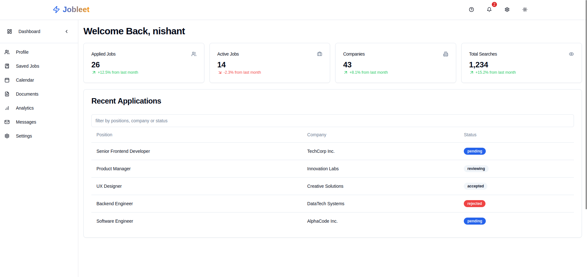

# Introduction

**Job Leet** is the smart recruitment platform designed to transform how job seekers and recruiters and Companies connect.  

## **Features**

- [x] **Personalized Job Recommendations**: Matches candidates with job openings tailored to their skills, preferences, and career goals.
- [ ] **Real-Time Notifications**: Keep both recruiters and candidates updated and engaged throughout the recruitment process.
- [x] **Analytics Dashboard**: Gain valuable insights into recruitment metrics to enhance decision-making and hiring strategies.
- [ ] **Communication System**: Streamline Real time communication between recruiters and candidates for seamless engagement.
- [ ] **Resume Builder**: Enable job seekers to create professional, standout resumes effortlessly.
- [x] **ERP Solution**: A comprehensive recruitment ERP solution to manage end-to-end hiring processes with ease.
- [ ] **Interview Scheduling**: Simplify interview scheduling with automated tools for recruiters and candidates.
- [x] **Role-Based Access Control**: Ensure secure data management with permissions based on user roles (e.g., recruiter, employer, admin).
- [x] **Job Application Tracking**: Real-time updates for job seekers to track their application status.
- [x] **Custom Branding**: Allow employers to personalize their profiles with their company branding.
- [x] **Feedback System**: Enable candidates and employers to exchange feedback for a better hiring experience.
- [x] **GDPR Compliance**: Ensure data protection and compliance with global regulations.
- [x] **Performance Reports**: Generate detailed reports on hiring performance and timelines.
- [ ] **Multi-Language Support**: Cater to a global audience with support for multiple languages.
- [x] **Talent Pool Management**: Build and manage a database of potential candidates for future roles.

## Documentation

For a complete list of methods and their usage, please refer to the [Api Documentation](https://nixhantb.github.io/Job-Leet-core-recruitment-agency/)